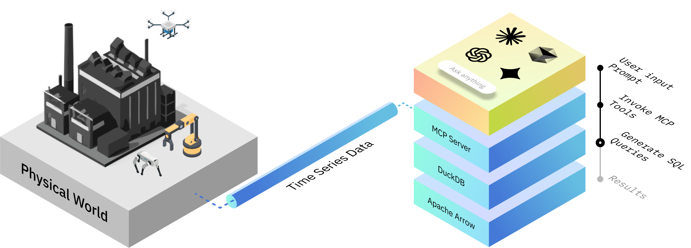
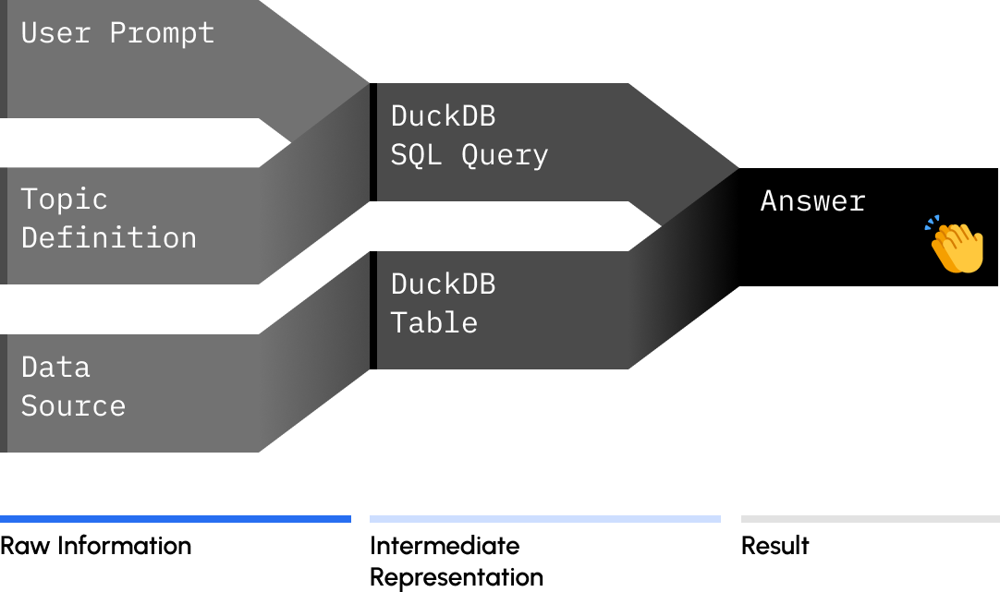

<p align="center">
  <picture>
    <source media="(prefers-color-scheme: dark)" srcset="./doc/assets/bagel_logo_dark_mode.png">
    
  </picture>
</p>

<h1 align="center">
  <a href="https://github.com/shouhengyi/bagel/blob/stage/LICENSE">
    
  </a>
  <a>
    
  </a>
  <a href="https://github.com/Extelligence-ai/bagel/actions/workflows/publish.yaml">
    
  </a>
  <a href="https://discord.gg/QJDwuDGJsH">
    
  </a>
</h1>

<p align="center">
  <picture>
    
  </picture>
</p>

<p align="center">
  <picture>
    
  </picture>
</p>

Bagel works with a wide range of common robotics and sensor log formats out of the box.
Don't see your format? [Open a ticket](https://github.com/shouhengyi/bagel/issues).

| Format                             |
| ---------------------------------- |
| ✅ **ROS 2** (`.mcap`, `.db3`)     |
| ✅ **ROS 1** (`.bag`)              |
| ✅ **PX4** (`.ulg`)                |
| ✅ **ArduPilot** (`.bin`)          |
| ✅ **Betaflight** (`.bbl`, `.BFL`) |

Don't forget to join our [Discord server](https://discord.gg/QJDwuDGJsH)! We'll be there to answer
your questions about Bagel and will sometimes drop merch!

## Quickstart

We are using ROS2 Kilted and Claude Code as example.

```sh
source /opt/ros/kilted/setup.sh  # Source ROS2 dependencies
uv sync --group ros2             # Install PyPI packages
uv run main.py up mcp            # Start Bagel MCP server
```

Open another terminal and run:

```sh
# Add Bagel MCP server to Claude Code
claude mcp add --transport sse bagel http://localhost:8000/sse

# Launch Claude Code
claude

# Happy prompting
> Summarize the metadata of robolog "./doc/tutorials/data/ros2".
```

The Bagel MCP server is **not exclusively tied to Claude**. You're free to integrate your
preferred LLMs with Bagel.

### Tutorials

- [Claude Code, PX4 ULog](./doc/tutorials/mcp/0_claude_code_px4.ipynb)
- [Gemini CLI, ROS2 Bag](./doc/tutorials/mcp/1_gemini_cli_ros2.ipynb)
- [Cursor, PX4 ULog](./doc/tutorials/mcp/2_cursor_px4.ipynb)
- [Claude Code, ArduPilot Dataflash](./doc/tutorials/mcp/3_claude_code_ardupilot.ipynb)
- [Claude Code, Betaflight](./doc/tutorials/mcp/4_claude_code_betaflight.ipynb)
- [Build a Data Pipeline from a PX4 ULog](./doc/tutorials/pipelines/0_basics.ipynb)
- [Read Topic Messages from a ROS2 Bag](./doc/tutorials/readers/1_read_by_topic.ipynb)

### Running in Docker 🐳

To run Bagel without installing local dependencies like ROS, you can use our provided Docker images. Make sure you have [Docker Desktop](https://docs.docker.com/desktop/) installed. This example uses ROS 2 Kilted.

#### Mount Your Data

First, give the container access to your robolog files. Open the [compose.yaml](./compose.yaml) file and find the service you want to use (e.g., ros2-kilted). Edit the volumes section to link your local data folder to the container's data folder.

```yaml
services:
  ros2-kilted:
    ...
    # volumes:                                     <-- ✅ Uncomment
    #   - <path-to-local-data>:/home/ubuntu/data   <-- ✅ Uncomment & Replace
```

Your local robolog files will be accessible inside the container at `/home/ubuntu/data`.

#### Launch the MCP Server

Build and start the Bagel MCP server in a container with these commands:

```sh
docker compose build ros2-kilted
docker compose run --service-ports ros2-kilted uv run main.py up mcp
```

Once you run this, if you don't want to rebuild the container, you can just run the second command.

## Roadmap

If there's something you have feedback on, or something you'd like to see, file a
[feature request](https://github.com/Extelligence-ai/bagel/issues) and let us know!

Features are organized into **Versions** for easier tracking. New features will be released regularly, and this README.md will be updated to show which ones have shipped. Strikethrough text indicates completed features.

#### V1

- Computer Vision (CV) Module
  - Video Language Model
  - Anomaly detection
  - Similarity search
- More Robotics Formats
  - ~~[Ardupilot](https://ardupilot.org/)~~
  - ~~[Betaflight](https://betaflight.com/)~~
- More LLMs
  - ~~Cursor~~
  - OpenAI
  - Llama
  - Copilot

#### V1.5

- Troubleshooting Toolkit
- Better User Experience
  - Message pagination
  - MCP resources
  - DSL for querying nested topic messages
- Easy Model Integration

#### V2

- Platform Integration
  - Foxglove
  - Rerun
- Better User Experience
  - Pip install and PyPI package
  - `bagel` CLI
