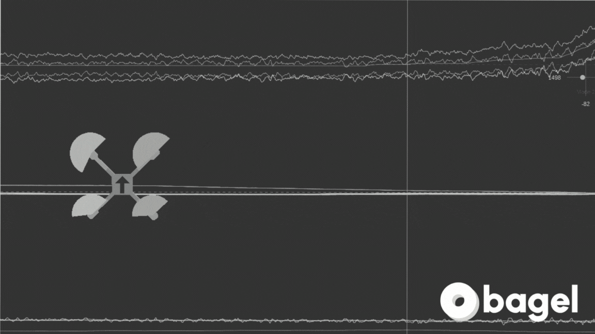

  <picture>
    <source media="(prefers-color-scheme: dark)" srcset="./doc/assets/bagel_logo_dark_mode.png">
    
  </picture>

<h1 align="center">
  
  
  
  
</h1>

  <picture>
    
  </picture>

Bagel lets you chat with your physical data — just like you do with ChatGPT.

### 🪄 Key Features

- **Understand your data effortlessly**: Ask complex questions without deep domain expertise.
- **Transparent and reliable calculations**: No black-box LLM math.
- **Broad LLM support**: Works with most MCP-enabled LLMs (e.g., Claude Code, Gemini, Cursor, Codex, etc.).
- **Simple setup**: Fully containerized with Docker—no local dependencies needed.
- **Wide data format coverage**: Don’t see your format? [Open a ticket](https://github.com/shouhengyi/bagel/issues).

### ✅ Supported Data Formats

| Industry     | Formats                    |
| ------------ | -------------------------- |
| **Robotics** | ROS1, ROS2                 |
| **Drones**   | PX4, ArduPilot, Betaflight |
| **IoT**      | Coming soon...             |

  <picture>
    
  </picture>

  <picture>
    
  </picture>

# ⚙️ Installation

# ⚡️ Quickstart

# 💻 Development
