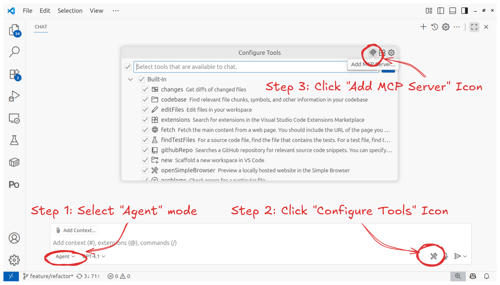

# Setting up Copilot in VSCode

This runbook explains how to connect your Bagel MCP server to Copilot in VSCode

## ✅ Verify Bagel Is Running

But first, make sure the Bagel MCP server is already running in a separate terminal.

If not, follow the [⚡️ Quickstart](../../../README.md#️-quickstart) guide to start it.

You can check if it’s running by visiting [http://0.0.0.0:8000/sse](http://0.0.0.0:8000/sse)
in your browser. You should see output like:

```
event: endpoint
data: /messages/?session_id=d3daa0110c1041dead46bc6646dc4dc7
```

## 🛠️ Install VSCode

[Download](https://code.visualstudio.com/download) and install VSCode.

## 🔗 Connect Bagel

Open the VSCode, then launch GitHub Copilot Chat (e.g., ⌘+ctrl+i on macOS,
ctrl+alt+i on Windows/Linux).

> [!NOTE]
> The UI may differ depending on your operating system. The screenshot below shows Cursor on Ubuntu.

Select **Agent** mode, click the **Configure Tools...** icon, and a popup will appear.

Click the **Add MCP Server...** icon on the top-right corner.

<p align="center">
  <picture>
    
  </picture>
</p>

From the dropdown menu, select **HTTP (HTTP or Server-Sent Events)**.

Enter `http://0.0.0.0:8000/sse`, name it `"bagel"`, and set the scope to **Global**.

This will add the Bagel MCP server to your VSCode configuration at `~/.config/Code/User/mcp.json`:

```json
{
  "servers": {
    "bagel": {
      "url": "http://0.0.0.0:8000/sse",
      "type": "http"
    }
  },
  "inputs": []
}
```

Open the **Extensions** panel, and Bagel should appear under **MCP SERVERS – INSTALLED**.

For more details on connecting MCP servers to Copilot, see the
[Copilot MCP doc](https://code.visualstudio.com/docs/copilot/customization/mcp-servers).

## 🎉 Congrats! You are all set.

Still having trouble? 🤦 It’s not your fault. [File a ticket](https://github.com/Extelligence-ai/bagel/issues) and let us know.
