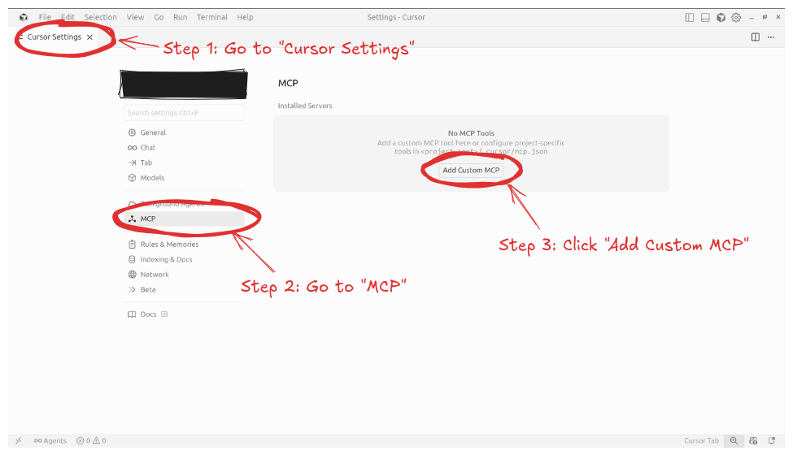

# Setting up Cursor

This runbook explains how to connect your Bagel MCP server to Cursor.

## ✅ Verify Bagel Is Running

But first, make sure the Bagel MCP server is already running in a separate terminal.

If not, follow the [⚡️ Quickstart](../../../README.md#️-quickstart) guide to start it.

You can check if it’s running by visiting [http://0.0.0.0:8000/sse](http://0.0.0.0:8000/sse)
in your browser. You should see output like:

```
event: endpoint
data: /messages/?session_id=d3daa0110c1041dead46bc6646dc4dc7
```

## 🛠️ Install Cursor

[Download](https://cursor.com/download) and install Cursor for your operating system.

## 🔗 Connect Bagel

Open the Cursor app and navigate to **Cursor Settings > MCP**. Then click **Add Custom MCP**.

> [!NOTE]
> The UI may differ depending on your operating system. The screenshot below shows Cursor on Ubuntu.

<p align="center">
  <picture>
    
  </picture>
</p>

Next, add the Bagel configuration to the `"mcpServers"` object in `~/.cursor/mcp.json`:

```json
{
  "mcpServers": {
    "bagel": {
      "url": "http://localhost:8000/sse"
    }
  }
}
```

**Save it** and return to the **Cursor Settings**. Ensure that bagel is toggled on and the status
indicator is green.

For more details on connecting MCP servers to Cursor, see the
[Cursor MCP doc](https://cursor.com/docs/context/mcp).

## 🎉 Congrats! You are all set.

Still having trouble? 🤦 It’s not your fault. [File a ticket](https://github.com/Extelligence-ai/bagel/issues) and let us know.
